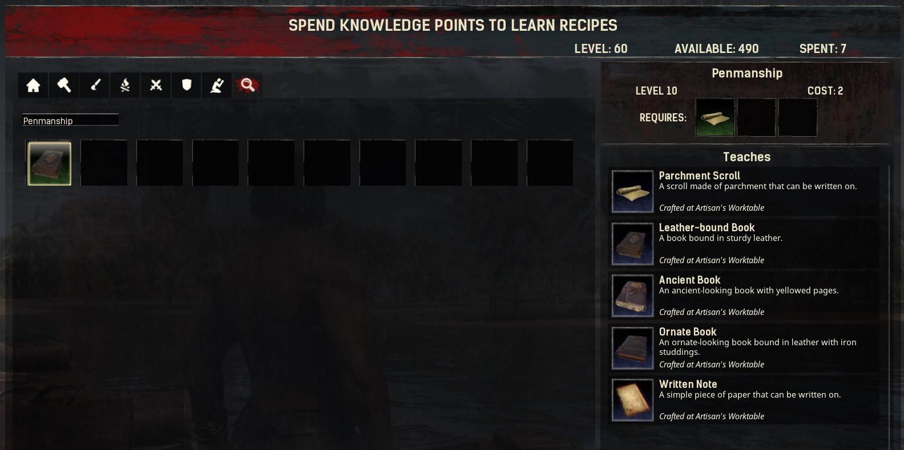

# Ravencrest Couriers

### Introduction

Welcome to the documentation page for the **Ravencrest Couriers** mod for Conan Exiles!
Here, you'll find information on what is included in the mod, and how you can use it.

### Items, Recipes and Feats

Currently, this mod contains the following craftable items:

- Written Note
- Parchment Scroll
- Leather-bound Book
- Ancient Book
- Ornate Book

All of these can be crafted at the **Artisan Table** after learning the feat **Penmanship**.

### Using the items

To interact with a note, scroll or book, place it in your shortcut bar, and activate it.

- If it's an empty document, you will be able to write into it.
- If it's an existing document containing text, you will be able to read it.

You can also place your items down into the world, so others can read it!
To do this, double-tap the corresponding item on your shortcut bar, instead of activating it with a single tap.

#### Notes

Notes may contain small, simple pieces of text.
You can place notes anywhere, even in areas that are claimed by other players!
Of course, this means that anyone can _remove_ your notes as well...

#### Scrolls

Scrolls may contain both text and images, but also have a limited length, just like notes.
To embed an image, just insert the image's URL into the text. For example:

> This is some text...
> Here is an image: https://i.imgur.com/SDJBJzb.png
> And here is some more text!

Scrolls can also be **sealed**, which will hide their contents until someone breaks the seal.
You can sign the seal with a short piece of text, like the initials or a cryptic name...

The person who receives the scroll can break the seal by clicking on the _Break Seal_ button.

Scrolls can be placed down, but only in an area you own. They act like regular placeables: other players _cannot_ pick them up. You can, of course, pick up the scroll yourself and just give it to someone else!

#### Books

Books may contain any number of pages. Each page may contain text and/or images, just like scrolls.
In addition, books have a _title_ and an _author_ which will be displayed in the item's description.

When writing or reading books, use the '<' and '>' buttons to switch between pages.

Books have the additional advantage that you can edit them after writing them. To do this, open the book for reading and select the _Edit_ button:

