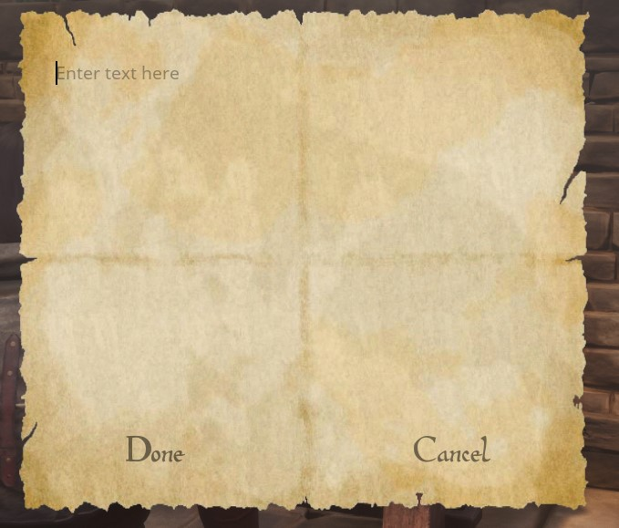
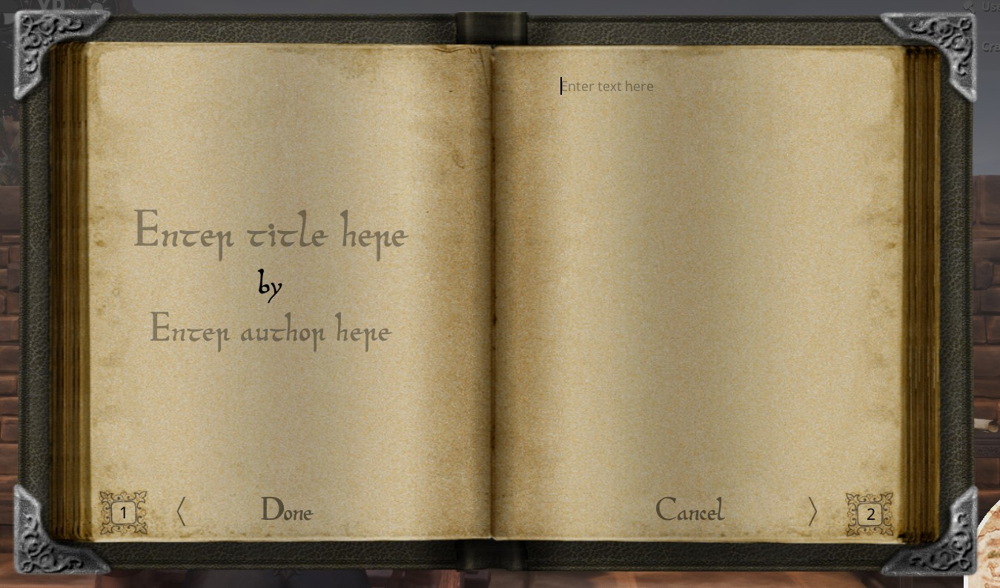

# Ravencrest Couriers

Welcome to the documentation page for the **Ravencrest Couriers** mod for Conan Exiles!
Here, you'll find information on what is included in the mod, and how you can use it.

## What does this mod do?

This mod aims to solve a long-standing concern for the Conan Exiles RP community: being able to write documents, and share them with other players!
While the vanilla game does contain notes and journals that you can write into, the possibilities are limited:

- You can only write one page of text
- You can only write on them after placing them into the world
- If you pick them up, the text is lost

Ravencrest Couriers offers in addition:

- Notes that can be placed in the bases of other players
- Scrolls that can be sealed
- Books that may contain multiple pages
- You can embed images in the text
- All items can be placed down and then picked up again, while preserving their contents
- All items can be read and written while in your inventory, e.g. a personal journal
- Craftable bird coops where you can train birds to send your documents to others

As for the future of this mod, there are _many_ more things we want to implement!
Please visit our Discord to see the roadmap, or to share your own ideas:

[https://discord.gg/FtWrKAZ](https://discord.gg/FtWrKAZ)

## Feats and Recipes

Ravencrest Couriers offers two feats that can be learned:

- **Penmanship**: Allows you to craft notes, scrolls and books that you can write into. Also allows you to craft bookcases, inkpots and quills.
- **Bird Keeper**: Allows you to build bird coops and train messenger birds in them. These birds can be used to send messages to other players.

## Reading and Writing

To interact with a note, scroll or book, place it in your shortcut bar, and activate it.


- If it's an empty document, you will be able to write into it.
- If it's an existing document containing text, you will be able to read it.

You can also place your items down into the world, so others can read it!
To do this, double-tap the corresponding item on your shortcut bar, instead of activating it with a single tap.

### Notes

Notes may contain small, simple pieces of text.
You can place notes anywhere, even in areas that are claimed by other players!
Of course, this means that anyone can _remove_ your notes as well...



### Scrolls

Scrolls may contain both text and images, but also have a limited length, just like notes.
To embed an image, just insert the image's URL into the text. For example:

> This is some text...
> Here is an image: https://i.imgur.com/SDJBJzb.png
> And here is some more text!

Scrolls can also be **sealed**, which will hide their contents until someone breaks the seal.
You can sign the seal with a short piece of text, like the initials or a cryptic name...


The person who receives the scroll can break the seal by clicking on the _Break Seal_ button.

Scrolls can be placed down, but only in an area you own. They act like regular placeables: other players _cannot_ pick them up. You can, of course, pick up the scroll yourself and just give it to someone else!


### Books

Books may contain any number of pages. Each page may contain text and/or images, just like scrolls.
In addition, books have a _title_ and an _author_ which will be displayed in the item's description.


When writing or reading books, use the '<' and '>' buttons to switch between pages.



Books have the additional advantage that you can edit them after writing them. To do this, open the book for reading and select the _Edit_ button:


## Bird Coops

After learning the feat **Bird Keeper**, you'll be able to craft different types of bird coops in the Blacksmith Bench.

After placing it down, the first thing you'll want to do, is give the coop a proper name.
This is the name other players will see (along with your clan name) in the list of destinations when they want to send a bird.
To name your coop, interact with it and click on the name on top to change it:


Hurrah! You're now ready to receive messages from other players. You'll hear the sound of a bird whenever a new message arrives.

### Sending messages

To send a message, interact with the coop and make sure a bird is nested in it.
To nest a bird, place a bird in the coop (either by training one or by taking one from another coop), select it and press the "Nest" button. Note that coops have a limited number of nesting slots!


Next, drag a nested bird into the Bird slot at the bottom, and drag a message into the Message slot. Only Written Notes and Parchment Scrolls can be carried by a bird.
Don't try to send a whole book, think of the poor bird!


Select a destination from the list of available destinations, and press the "Send" button. You'll hear a sound of the bird taking off, and your message will be underway!
When the bird returns from its journey, you'll hear its sound and it will nest in the coop again.

## Server Settings

Administrators can tune several settings related to this mod. Below is an overview:

- **baseFlightDurationSec**: the number of seconds it takes a bird to reach its destination. Default value: 3600 seconds.
- **checkMessageFrequencySec**: how often the server will run a check for message delivery. Default value: 60 seconds.
- **allowRenderImages**: use this setting to prevent scrolls and books from showing images. Default value: true (images are allowed).

To change a setting, you must have administrator privileges. Open the console (by default using the tilde '~' sign), and enter the command:
```
DataCmd RACO set <settingName> <settingValue>
```
For example:
```
DataCmd RACO set baseFlightDurationSec 1800
```
Will reduce the bird flight duration from 3600 to 1800 seconds.