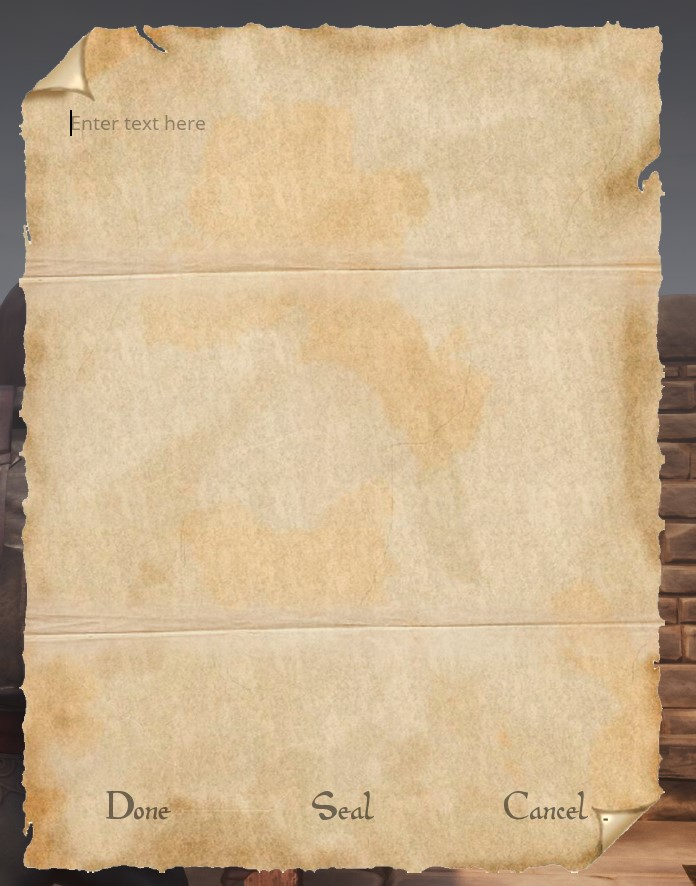
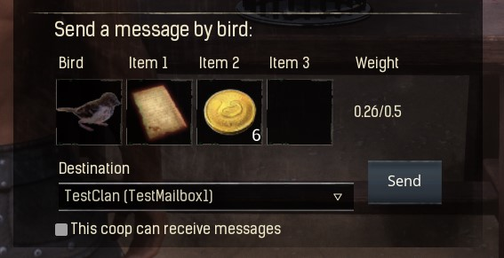
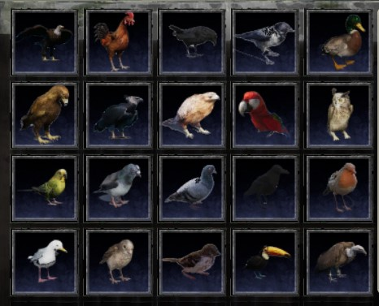
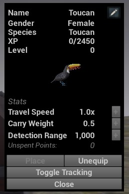

# Ravencrest Couriers

Welcome to the documentation page for the **Ravencrest Couriers** mod for Conan Exiles!
Here, you'll find information on what is included in the mod, and how you can use it.

## Table of Contents

* [What does this mod do?](#what-does-this-mod-do)
* [Feats and Recipes](#feats-and-recipes)
* [Reading and Writing](#reading-and-writing)
* [Bird Coops](#bird-coops)
* [Birds](#birds)
* [Tracking](#tracking)
* [Mail Boxes](#mail-boxes)
* [Server Settings](#server-settings)

## What does this mod do?

This mod aims to solve a long-standing concern for the Conan Exiles RP community: being able to write documents, and share them with other players!
While the vanilla game does contain notes and journals that you can write into, the possibilities are limited:

- You can only write one page of text
- You can only write on them after placing them into the world
- If you pick them up, the text is lost

Ravencrest Couriers offers in addition:

- Notes that can be placed anywhere, even in the base of other players
- Scrolls that can be sealed with a custom seal image
- Books that may contain multiple pages with text and images
- All items can be placed down and then picked up again, while preserving their contents
- All items can be read and written while in your inventory, e.g. a personal journal
- Craftable bird coops where you can train birds to send messages to other players
- Craftable mail boxes where other players can deposite items into, or send their birds to
- Birds are animated and can be placed on your shoulder
- Birds can also be placed in the world, and optionally configured to emit a cry whenever a player approaches

As for the future of this mod, there are still more things we want to implement!
Please visit our Discord to see the roadmap, or to share your own ideas:

[https://discord.gg/FtWrKAZ](https://discord.gg/FtWrKAZ)


## Feats and Recipes

Ravencrest Couriers offers two feats that can be learned:

- **Penmanship**: Allows you to craft notes, scrolls and books that you can write into. Also allows you to craft bookcases, inkpots and quills, and mailboxes.
- **Bird Keeper**: Allows you to build bird coops and train messenger birds in them. These birds can be used to send messages to other players.


## Reading and Writing

To interact with a note, scroll or book, place it in your shortcut bar, and activate it.


- If it's an empty document, you will be able to write into it.
- If it's an existing document containing text, you will be able to read it.

### Placing down a note, scroll or book

You can also place your items down into the world, so others can read it!
To do this, **double-tap** the corresponding item on your shortcut bar, instead of activating it with a single tap.

### Notes

Notes may contain small, simple pieces of text or images.
You can place notes anywhere, even in areas that are claimed by other players!
Of course, this means that anyone can _remove_ your notes as well...


To embed an image, just insert the image's URL into the text. For example:

> This is some text...
> Here is an image: https://i.imgur.com/SDJBJzb.png
> And here is some more text!

### Scrolls

Scrolls may contain both text and images, but also have a limited length, just like notes.
Scrolls can also be **sealed**, which will hide their contents until someone breaks the seal.
You can sign the seal with your name, or with a custom seal image.


The person who receives the scroll can break the seal by clicking on the _Break Seal_ button.

Scrolls can be placed down, but only in an area you own. They act like regular placeables: other players _cannot_ pick them up. You can, of course, pick up the scroll yourself and just give it to someone else!



### Books

Books may contain any number of pages. Each page may contain text and/or images, just like scrolls.
In addition, books have a _title_ and an _author_ which will be displayed in the item's description.


When writing or reading books, use the '<' and '>' buttons to switch between pages.


Books have the additional advantage that you can edit them after writing them. To do this, open the book for reading and select the _Edit_ button:


## Bird Coops

After learning the feat **Bird Keeper**, you'll be able to craft different types of bird coops in the Blacksmith Bench.

After placing it down, the first thing you'll want to do, is give the coop a proper name.
This is the name other players will see (along with your clan name) in the list of destinations when they want to send a bird.
To name your coop, interact with it and click on the name on top to change it:


Hurrah! You're now ready to receive messages from other players. You'll hear the sound of a bird whenever a new message arrives.

### Sending messages

To send a message, interact with the coop and make sure a bird is nested in it.
To nest a bird, place a bird in the coop (either by training one or by taking one from another coop), select it and press the "Nest" button. Note that coops have a limited number of nesting slots!


Next, drag a nested bird into the Bird slot at the bottom, and drag one or more items into the Item slots.
Keep an eye on the weight! Birds can only carry a limited amount of items, and will fly slower if their weight is over 50%.
For more info, see  the "Bird Stats" topic.



Select a destination from the list of available destinations, and press the "Send" button. You'll hear a sound of the bird taking off, and your message will be underway!
When the bird returns from its journey, you'll hear its sound and it will nest in the coop again.

## Birds

Birds are trained in a bird coop. You'll note a number of different bird types are available to craft. Each bird has their own visuals, sounds, animations
and base stats.



Some birds, such as eagles, are so large they can only nest in large coops. Don't try to squeeze the poor things into a small coop!

### Bird Stats

To see the stats of a bird, put the bird in your shortcut bar and activate it. A Bird Profile window will appear.


You'll note that birds start at level 0, just like thralls. And just like thralls, you can level them up to level 20.
There are two ways for a bird to gain XP:

* Birds will gain a certain amount of XP for each message they deliver
* Birds will gain passive XP per hour when they sit on your shoulder

When a bird levels up, you get a level point to spend on one of these stats:

* **Travel Speed**: each point will make the bird faster, allowing it to deliver messages in less time.
* **Carry Weight**: each point will make the bird stronger, allowing it to carry more weight.
* **Detection Range**: each point will make the bird more alert, increasing its range to detect objects when in Detection Mode (see below), or in [Tracking](#tracking) mode.

### Placing birds

To place a bird down in the world (just like any other decorative placeable), put it in your shortcut bar, open the bird's profile, and then select "Place".

Alternatively, while the bird is in your inventory, you can display it on your shoulder. To do this, put it in your shortcut bar, open the bird's profile,
and then select "Equip". The bird will gain passive XP as long as it's sitting on your shoulder.
To remove it from your shoulder, open the profile again and select "Unequip".

### Detection Mode

When a bird is placed down, it can be switched into _Detection Mode_. This means the bird will be on the lookout for other players, and make a sound whenever
a player enters a certain range. Hold E on a placed bird and select "Configure Detection Mode" to configure it:


The available settings are:

* **Detection Mode Enabled**: if set, the bird will be on the lookout. If this setting is disabled, the bird will just be a decorative placeable.
* **Detection Radius**: this is the range (in centimeters) that the bird will scan.
* **Detect Types**: here, you can choose which types of players the bird should respond to.

## Tracking

When you have a bird perched on your shoulder, you can activate its profile again and press **Toggle Tracking** to enable or disable tracking mode.



In tracking mode, your bird can detect various types of nearby entities. The tracking range is determined by the bird's **Detection Range** stat.
The following types of objects can be tracked:

* The bird will always track other birds, either placed birds or birds in coops.
* The bird can track wild and tamed NPCs and animals, but only if an admin has enabled this feature (see [Server Settings](#server-settings)).
* The bird can track other players, but only if an admin has enabled this feature (see [Server Settings](#server-settings)).


**Note:** tracking happens entirely on the client-side, and will not affect server performance in any way.

## Mail Boxes

Learning the **Penmanship** feat will allow you to construct Mail Boxes in the blacksmith's bench.
Mailboxes offer a unique mechanic to receive messages and other items from players (or via messenger birds) without giving them access to the container itself:
players can drop items, but cannot retrieve any items from the mailbox.


### Setting up a mail box

- The first thing you'll want to do after placing down a mailbox, is **lock** it. If you don't lock the mailbox, it will act like a regular unlocked container!
- Just like coops, you can name your mailboxes. Interact with the mailbox and click on the name to change it.
- By default, your mailboxes can also receive messages via birds. If you don't want this, make sure to uncheck the option "This box can receive bird messages":


### Using a mail box

To deposit items into a mailbox, interact with it, and then drag up to 5 items into the depositing slots:


Click "Deposit" to drop your items into the mailbox. That's it! Your items are now deposited, and the owner can retrieve them at any time.
Note that mailboxes have a limited size. If the mailbox is full, you'll get a message when trying to deposit more items.

## Server Settings

Administrators can tune several settings related to this mod. Below is an overview:

- **baseFlightDurationSec**: the number of seconds it takes a bird to reach its destination. Default value: 3600 seconds.
- **checkMessageFrequencySec**: how often the server will run a check for message delivery. Default value: 60 seconds.
- **allowRenderImages**: use this setting to prevent scrolls and books from showing images. Default value: true (images are allowed).
- **birdXPPerHour**: the amount of XP a bird receives every hour when sitting on a player's shoulder. Default value: 5000.
- **birdXPPerMessage**: the amount of XP a bird receives every time it delivers a message. Default value: 10000.
- **detectionModeEnabled**: enable or disable the use of Detection Mode on birds. Default value: true (Detection Mode is allowed).
- **allowCopyBooks**: enable the button to copy books for all players, admins only, or nobody. Possible values: `all`, `admin`, `none`. Default value: `none`.

To change a setting, you must have administrator privileges. Open the console (by default using the tilde '~' sign), and enter the command:
```
DataCmd RACO set <settingName> <settingValue>
```
For example:
```
DataCmd RACO set baseFlightDurationSec 1800
```
Will reduce the bird flight duration from 3600 to 1800 seconds.